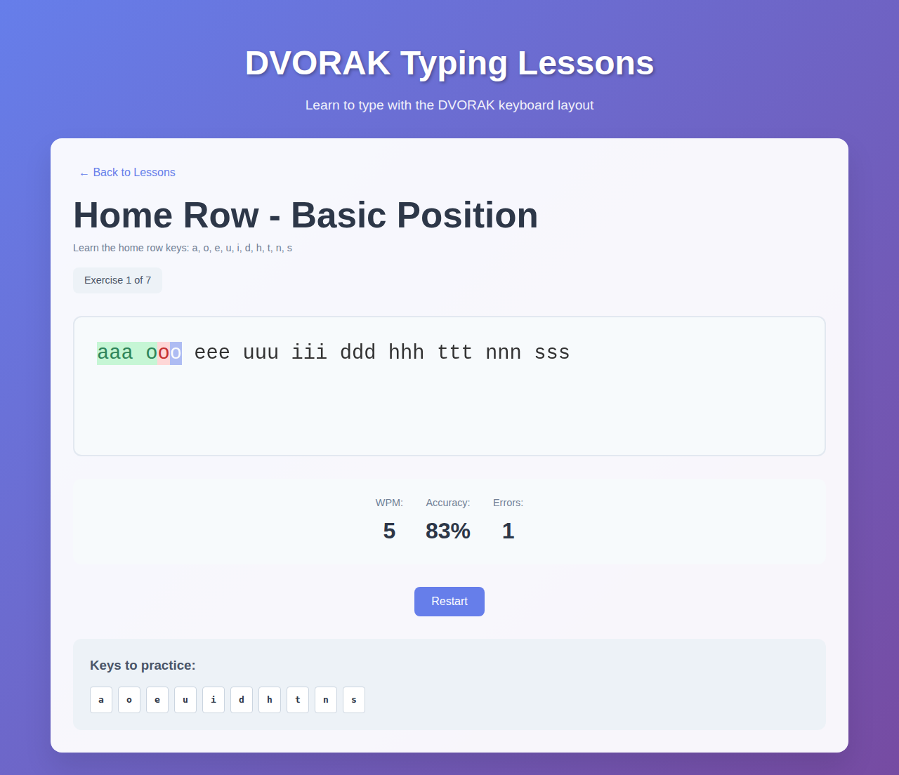
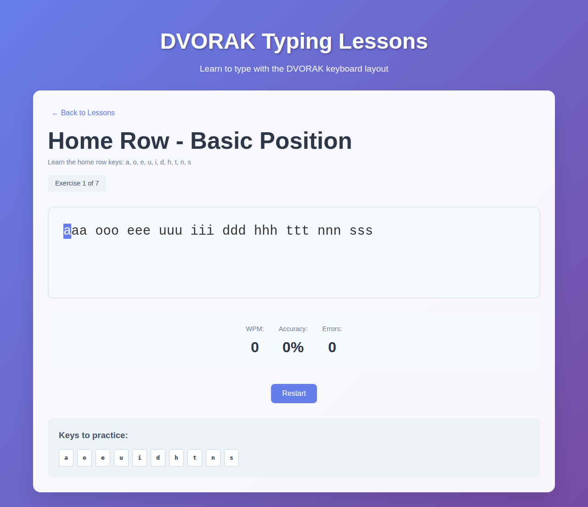

# Dvorak Lessons

A lightweight React + TypeScript app for practicing the Dvorak keyboard layout through lesson-based typing drills. Built with Vite for fast local development.

- Tech stack: React, TypeScript, Vite, ESLint
- Code organization:
  - src/components – UI building blocks (lesson runner, stats, etc.)
  - src/data – Lesson content and configuration
  - src/hooks – Typing and lesson logic as reusable hooks
  - src/types – TypeScript types and interfaces
  - src/App.css – App styles

## Features

- Lesson-based typing practice for the Dvorak layout
- Real-time feedback while typing (intended accuracy/speed support)
- Minimal, focused interface
- Fast startup and hot-reload via Vite

## Screenshots

### Lesson Selector Interface


The main interface shows all available lessons with clear descriptions and progress indicators.

### Typing Lesson Interface


Clean, focused typing interface with keyboard reference and exercise progression.

### Real-time Character Feedback


Live feedback system showing green (correct) and red (incorrect) character highlighting with real-time statistics.

## Getting Started

Prerequisites:
- Node.js (LTS recommended)

Install dependencies:
```bash
npm install
```

Run the dev server:
```bash
npm run dev
```

Build for production:
```bash
npm run build
```

Preview the production build:
```bash
npm run preview
```

Lint the project:
```bash
npm run lint
```

## Project Structure

```text
.
├─ public/
│  └─ screenshots/        # Place README images here (see “Screenshots”)
├─ src/
│  ├─ components/         # UI components
│  ├─ data/               # Lesson data
│  ├─ hooks/              # Custom hooks for typing/lesson logic
│  ├─ types/              # TypeScript types
│  ├─ App.css
│  ├─ App.tsx
│  ├─ index.css
│  └─ main.tsx
├─ index.html
├─ package.json
├─ tsconfig*.json
└─ vite.config.ts
```

## How to Generate Screenshots

Below are two simple ways to capture and add screenshots to public/screenshots:

1) Manual (recommended for first pass)
- Start the app with npm run dev and open it in your browser.
- Take screenshots of the key states (overview, typing in progress, lesson complete).
- Save them as:
  - public/screenshots/overview.png
  - public/screenshots/typing-in-progress.png
  - public/screenshots/lesson-complete.png

2) Command-line (automated)
- Use a tool like capture-website-cli to snapshot the running app:

```bash
# Install once
npm i -D capture-website-cli

# Make sure the dev server is running (npm run dev)
npx capture-website http://localhost:5173 public/screenshots/overview.png --delay=1

# Repeat for additional states as needed
```

## Acknowledgements

- Built with Vite’s React + TypeScript template.
- Inspired by Dvorak typing practice [ABCD: A Basic Course in Dvorak](http://gigliwood.com/abcd/lessons/)
